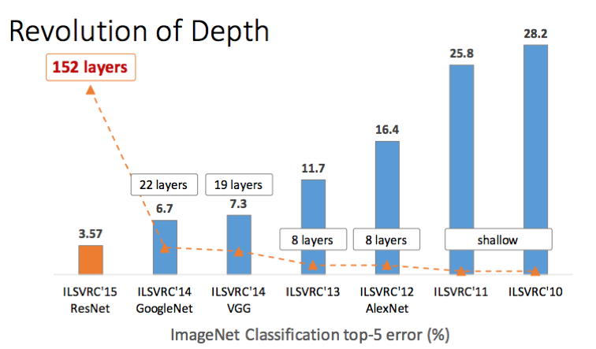
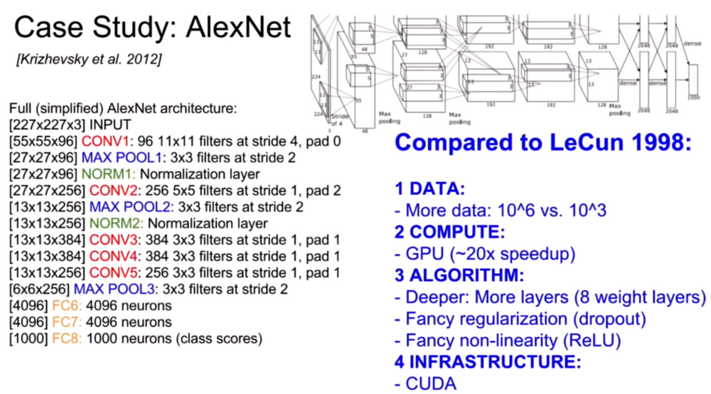

# A short History of recent Developments in Machine Learning

This is just for my own sanity. A brief overview of the development of machine learning ML, image classification, object detection, self-driving car expectations, generative pre-trained transformer GPT, AI, AGI, general and generative AI.

## Manual labeling images for Machine Learning - 2007 Image Net

As [Fei Fei Li](https://en.wikipedia.org/wiki/Fei-Fei_Li) explains in her [TET talk in 2015](https://www.youtube.com/watch?v=40riCqvRoMs) the group at Stanford started in 2007 to classify around 1,000,000,000 pictures and used [Amazon Mechanical Turk](https://en.wikipedia.org/wiki/Amazon_Mechanical_Turk) with 48,940 workers in 167 countries to create the image database [ImageNet](https://en.wikipedia.org/wiki/ImageNet). By 2009 the database [https://www.image-net.org/](https://www.image-net.org/) had 14,197,122 labeled images in 21,841 categories. And funding back then was a problem!

## ILSVRC competition - 2010

The initial approach was to look for features manually in the pictures (hard-coded) to classify them correctly. The top-5 error rate in 2010 was 28.2% with this approach. A deep neural network for deep learning would make big progress 2 years later!

## Progress in Image Classification - 2012 AlexNet with a convolutional neural network - CNN

To win the ImageNet 2012 challenge [AlexNet](https://en.wikipedia.org/wiki/AlexNet) used __GPUs__ for its concolutional neural network CNN. Its running on CUDA. This competition ILSVRC started in 2010 and ran until 2017. The creator of ImageNet Fei Fei Li gave an [inspiring TED talk in 2015](https://www.youtube.com/watch?v=40riCqvRoMs) including the AlexNet solution. Self driving cars are mentioned at minute 1:30. And how much a three-year old can outperform a computer. And Elon Musk is talking since 2014 that autonomous driving is just a year away.

## Deep Learning for Computer Vision - 2016 Andrej Karpathy

A [great talk about Deep Learning](https://www.youtube.com/watch?v=u6aEYuemt0M) by Andrej Karpathy from September 25, 2016 explains in detail and clarity the different layers in AlexNet and further develpments.

| layer     | size      | architecture                        |    memory | parameter |
|-----------|-----------|-------------------------------------|----------:|----------:|
| INPUT     | 227x227x3 |                                     |   154,587 |         0 |
| CONV1     | 55x55x96  | 96 11x11 filters at stride 4, pad 0 |   290,400 |    11,616 |
| MAX POOL1 | 27x27x96  | 3x3 filters at stride 2             |    69,984 |         0 |
| NORM1     | 27x27x96  | Normalization layer                 |    69,984 |         0 |
| CONV2     | 27x27x256 | 256 5x5 filters at stride 1, pad 2  |   186,624 |     6,400 |
| MAX POOL2 | 13x13x256 | 3x3 filters at stride 2             |    43,264 |         0 |
| NORM 2    | 13x13x256 | Normalization layer                 |    43,264 |         0 |
| CONV3     | 13x13x384 | 384 3x3 filters at stride 1, pad 1  |    64,896 |     3,456 |
| CONV4     | 13x13x384 | 384 3x3 filters at stride 1, pad 1  |    64,896 |     3,456 |
| CONV5     | 13x13x256 | 256 3x3 filters at stride 1, pad 1  |    43,264 |     2,304 |
| MAX POOL3 | 6x6x256   | 3x3 filters at stride 2             |     9,216 |         0 |
| FC6       | 4096      |                                     |     4,096 |         0 |
| FC7       | 4096      |                                     |     4,096 |         0 |
| FC8       | 1000      | 100 neurons (class scores)          |     1,000 |         0 |
|           |           |                                     | 1,049,571 |    27,232 |

## Object detection - 2017 YOLO

The [TED Talk from August 2017](https://www.youtube.com/watch?v=Cgxsv1riJhI) by Joseph Redmon from Washington University inspired ideas and possibilities. In his talk he talked about the application for self driving cars. It certainly makes it imaginable, and it was just running on his laptop! 

## Application in diploma thesis in Saigon - 2018

A student at [HCMUTE](https://en.wikipedia.org/wiki/Ho_Chi_Minh_City_University_of_Technology_and_Education) used this [YOLO](https://www.youtube.com/watch?v=MPU2HistivI) (You Only Look Once) software with an NVidia graphics card in his master thesis 2018 for an part in developing an autonomous car. But the [GTX 980](https://en.wikipedia.org/wiki/GeForce_900_series) with 2048 CUDA cores need 165 Watt power to work. The power requirement is a challenge for a mobile application.

## Tensorflow.lite and posenet on new RX 470 GPU - March 2019

The crypto-boom was over and graphics cards available again. So I started with an RX 470 in March 2019. In October 2018 I had already successfully installed Darknet on Ubuntu. The new repository [https://github.com/kreier/ml](https://github.com/kreier/ml)

## Mobile affordable platform - 2019 Jetson Nano

Nvidia had the Jetson TK1 platform already created in 2014, but it was power hungry and expensive. But for just 100 Dollar the Jetson Nano was announced in 2019 to be affordable for student projects with just using 5-10 Watt. We applied for a project at hackster.io. But ultimately we ordered a 4GB development platfrom at the end of 2019 for student projects.

The drive base from TAE was delayed early 2020 because of the starting COVID-19 pandemic and shipments from China. But eventually we got the drive base. Yet the project stalled from 2020-2024.

## Challenges of self driving - 2024

It seemed like the combination of object detection and classification was the main problem to get self driving cars possible, together with latency. As it turns out, there is much more to do. Additinal sensors like LIDAR really help, even Tesla finally gave in. And here are some example videos to show whats possible and what is still challenging:

- [Why self-driving cars have stalled | It's Complicated](https://www.youtube.com/watch?v=4sCK-a33Nkk) by The Guardian September 2022
- [I RACED My Self-Driving RC Car](https://www.youtube.com/watch?v=zuyOdaQ2xuw) by Steven Gong in July 2023, taking part in the [F1 tenth](https://f1tenth.org/) race 2023
- [Sorry. Your Car Will Never Drive You Around.](https://www.youtube.com/watch?v=2DOd4RLNeT4) - from January 2024, self driving cars are 8times __less__ save than humans, see data at minute 15 and 11.3 deaths per 100 million miles for Tesla FSD versus 1.35 deaths for humans
- [Video First AI powered Race - A2RL Abu Dhabi](https://www.youtube.com/watch?v=feTxamTHQAA) - dissaster 2024-04-28 [https://a2rl.io/](https://a2rl.io/)
